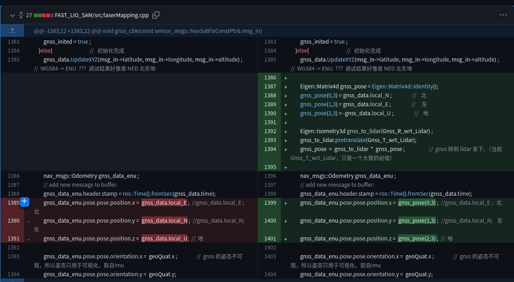

# FASTLIO-SAM更新日志

非常感谢大家的stars和关注，由于前端时间一直在忙秋招找工作的事宜，所以没办法解答大家的问题，最近通过issuses 大家反馈的问题，进行代码的更新，幷进行记录。

## 2022.12.9  更新  

commit 2d0a041ef776a52b2c4a4f6e66bf576804c4de45

1.针对大家提及的，播放数据集时，建图速度很慢的问题，其实是由于在cmakelists中，注释了优化编译的选项导致，优化编译可以在编译阶段，把代码中一些冗余部分进行预编译，已提升运行过程中的速率。之前注释优化编译，是为了debug的方便。如果大家要较快速建图，可以在cmakelists中把优化编译选项打开。

2.删除了自带的livox_ros_driver  package，大家可以根据需要，自行在livox官网下载livox的ros驱动即可

## 2022.12.22  更新 

1.之前笔误，复制错了空白变量到代码中，导致编译报错，已删除

2.针对之前的一个bug，数据集播放到中期，程序崩掉了，后来debug到，是出现了空指针了，已修复，详细如下：

## 2023.12.27  更新 

1.修复parking dataset 坐标系转换问题，LIO-SAM parking dataset GNSS 坐标为 北东地 对应 XYZ 

​			  																																															   edited by kaho 2023.12.27